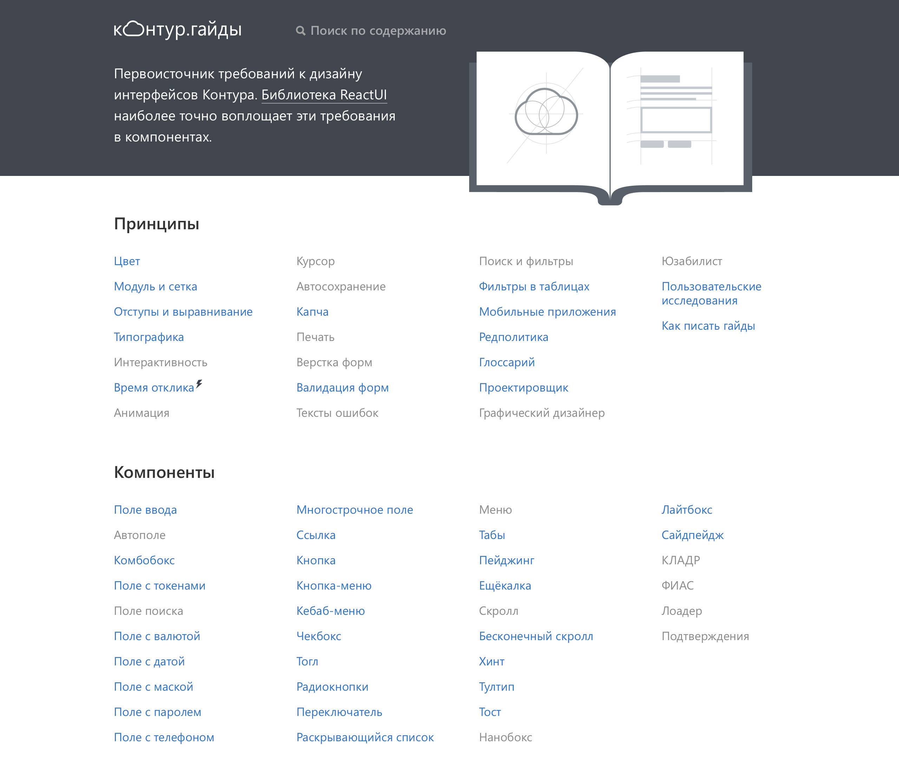
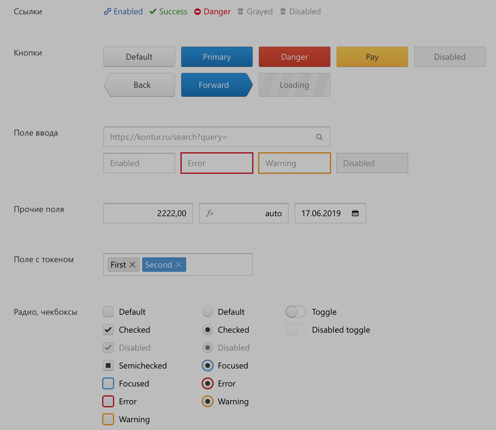
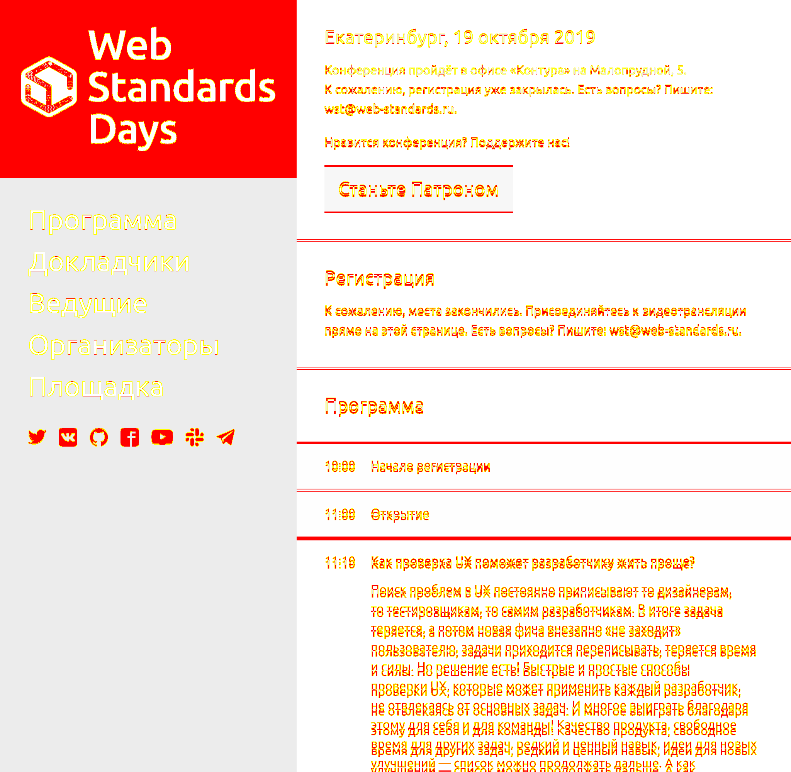
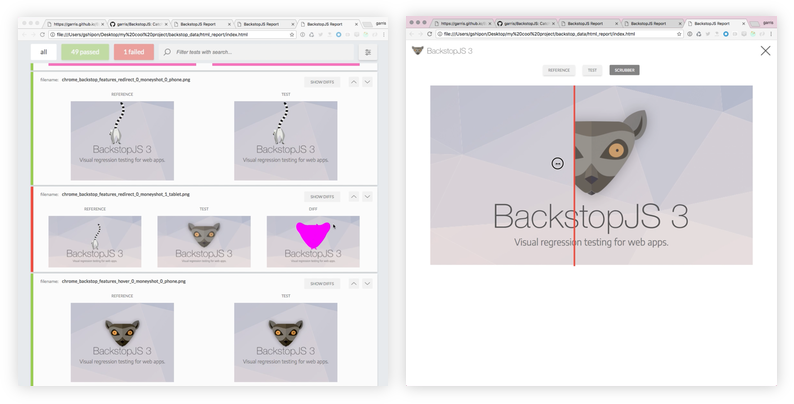

---
revealOptions:
  transition: none
  controls: false
---

<link href="./Roboto-Regular.ttf" rel="stylesheet">

## Гарри Поттер

## и

## скриншотные тесты


<br />

<br />

Лазарев Дмитрий

NOTE: Всем привет.

---

 <!-- .element style="float: left" -->

Работаю тимлидом в команде «Инфраструктура фронтенда» Контура. <!-- .element style="text-align: left; padding-left: 300px; padding-top: 20px" -->

NOTE: Меня зовут Дима Лазарев. Я работаю фронтендером в Контуре 3.5 года. Пилю всякие сложные инфраструктурные штуки. Веду внутренний подкаст о фронте. В данный момент работаю тимлидом в команде "Инфраструктура фронтенда".

---

## Инфраструктура фронтенда

Помощь командам в налаживании

- Тестирование
- Сборка
- Общие компоненты/библиотеки

NOTE: Чем занимается наша команда. Мы создаем инструменты для тестирования и ускорения старта разработки новых проектов, аккумулируем лучшие практики и занимаемся разработкой общих библиотек и компонентов. Основные нашие продукты, это Контур.Гайды.

---

 <!-- .element style="width: 65%; filter: brightness(0.7)" -->

NOTE: Контур.Гайды, это дизайн система с описанием логики работы контролов и общими рекомендациями к проектированию интерфейсов. Помогая тем самым проектировщикам создавать интерфейсы продуктов в едином стиле. На основе гайдов мы разрабатываем библиотеку общих компонентов react-ui.

---

 <!-- .element style="width: 65%" -->

NOTE: Opensource библиотека базовых react компонентов, реализованных согласно гайдам. Большинство команд используют их для создания интерфейса продуктов. Для нас как инфраструктурной команды важно уметь быстро выкатывать фичи в компонентах и не увеличивать кол-во багов. Это напрямую отражается на скорости выкатывания фич в продуктах и удовлетворенности пользователей. Поэтому мы используем у себя скриншотные тесты.

---

## Скриншотные тесты

<br />

<br />

<br />

NOTE: Поднимите руки кто знает что-нибудь про скриншотные тесты. А теперь те кто использует их у себя в проекте. Много народу: Круто что многие используют их, наверняка вы сталкивались с проблемами когда внедряли их, я кратко пробегусь по ним и то как их можно решить в конце расскажу какой путь выбралив контуре. Мало народу: Не густо, возможно у меня получится кого-нибудь из вас вдохновить внедрить к себе скриншотные тесты.

---

## Скриншотные тесты

- Автоматизация тестирования верстки
- Проверка визуального отображения в разных браузерах

NOTE: Основная цель скриншотных тестов, автоматизация тестирования верстки и проверка визуального отображения в разных браузерах. Тем самым меняя код компонента мы можем быть уверены, что ничего не сломали в существующих сценариях использования. Если у вас в проекте есть переиспользуемые компоненты, то скриншотное тестирование значительно облегчит жизнь вам и вашим тестировщикам. Звучит неплохо. Рассмотрим на примере гипотетического проекта с чем можно столкнуться при попытке внедрить скриншотные тесты. Начинается всё с того что в один прекрасный момент к вам приходит тестер со словами.

---

## Я задолбался...

NOTE: Я задолбался... С каждым релизом вручную протыкивать в разных браузерах странички сервиса, заполнять формочки и проверять что ничего не уехало. Зачастую из-за замыленного глаза пропускать баги в релиз. Вы решаете что пришло время внедрить скриншотные тесты.

---

## Исходные данные

- Наличие E2E тестов
- Тесты гоняются локально и в CI <!-- .element class="fragment" data-fragment-index="1" -->
- Разработчики используют Storybook <!-- .element class="fragment" data-fragment-index="2" -->

NOTE: Допустим что в нашем гипотетическом проекте уже есть E2E тесты, проверяющие различные пользовательские сценарии. Эти тесты можно запустить локально и они гоняются в CI. Разработчики в проекте используют Storybook для разработки компонентов или частей интерфейса.

---

## Попытка номер раз

- Внедряем скриншотные тесты в существующие E2E тесты

NOTE: Первый логичным шагом выглядит попытка внедрить скриншотные тесты в существующие e2e тесты. Так как уже есть какая-то инфраструктура для тестов. В этих тестах загружатся реальный интерфейс сервиса, прокликиваются основные страницы. Кажется вот оно, добавляем в тесты снятие скриншотов и попиксельное сравнение картинок. Но сразу обнаруживаем что скриншоты очень чувствительны к окружению.

---

 <!-- .element style="width: 65%; filter: brightness(0.7)" --> 

---

 <!-- .element style="width: 65%; filter: brightness(0.7)" --> 

NOTE: Видете разницу?

---

 <!-- .element style="width: 65%; filter: brightness(0.7)" -->

NOTE: А она есть.

---

## Чувствительность к окружению

- Браузер и версии
- Шрифты
- ОС и настройки ОС
- Видеокарта
- Фаза луны, настроение тестировщика и тд

NOTE: На результат влияет очень много факторов. Начиная с разных браузеров, их версий, операционной системы, шрифтов, заканчивая видеокартой, порой даже кажется что на это влияет фаза луны или настроение тестировщика. Было наивно думать что всё будет так просто, пока у нас ещё есть энтузиазм, попытаемся найти решение этой проблемы.

---

## Гонять на одной тачке

- Не распараллелить
- Тяжело дебажить
- Без CI

NOTE: Во-первых мы можем на уровне договоренностей в команде ограничить запуск скриншотных тестов одной тачкой, например на тачке тестера, дешево и сердито. Это вполне себе решение на какое-то время. Но про нормальный дебаг можно забыть. Хочется какого-то человеческого решения.

---

## Сравнивать prod и dev

- В два раза больше времени или ресурсов
- Тесты почти всегда красные

NOTE: Можно попробовать не хранить эталонные скриншоты в репа, а генерировать на основе продакшен и разрабатываемой версии сервиса и сравнивать эти скриншоты. Тут есть такие нюансы, что на прогон надо тратить или в два раза больше времени или ресурсов. А ещё у нас отсутствует какой-либо механизм аппура. Например при законном изменении, добавление кнопки на форму, скриншоты гарантированно будут разваливаться, до тех пор пока не выкатится в прод новая версия. Пытаясь решить проблему сравнения скриншотов отрендериных в разных окружениях нас посещает мысль, а может быть нам хранить в качестве эталона не картинку, а исходных html из которого наш браузер будет рендерить скриншот.

---

## Сохранять HTML как эталон

- Кроме html надо сохранять ещё css <!-- .element class="fragment" data-fragment-index="1" -->
- А ещё и состояние полей ввода <!-- .element class="fragment" data-fragment-index="2" -->
- И ховер <!-- .element class="fragment" data-fragment-index="3" -->
- И скролл <!-- .element class="fragment" data-fragment-index="4" -->
- Есть шанс ложно-положительного срабатывания <!-- .element class="fragment" data-fragment-index="5" -->

NOTE: Мы решаем проблему с окружением, так как всегда рендерим скриншот из эталонного HTML и скриншот тестируемой страницы. Правда одного только HTML недостаточно, надо сохранять CSS, а ещё состояние полей ввода, и ховер, и скролл. Ещё что-то? Вообще решение вполне себе рабочие, если устаканить некоторые нюансы. Правда таким образом можно поймать ложно-положительное срабатывание. Например при обновлении версии браузера может поехать верстка, а из-за того что исходный код страницы не изменился, мы не увидим проблему.

---

## Machine Learning

- Модный тренд
- Можно уменьшить кол-во ложных срабатываний
- Нужно много вкладываться в R&D

NOTE: Можно упороться и попытаться разобтаться с ML. Во всяком случае уже существуют сервисы, которые используют ML именно для скриншотных тестов.

---

## Виртуальные машины

- Детерминированное окружение
- Легко масштабируется

NOTE: Снимать скриншоты в браузерах запущенных в виртуальной машине. Здесь мы получаем всегда детерминированное окружение. И виртуалки легко масштабируются. Для гипотетического проекта был выбран этот вариант. Большинство сервисов предоставляющих услуги для скриншотных тестов под капотом используют именно пул виртуальных машин

---

## Несколько месяцев спустя...

NOTE: Допустим мы как-то побороли проблему с окружением, репортовали на очередном скраме об успешном внедрении скриншотных тестов. Началась будничная рутина и спустя какое-то время начинает копиться некоторая неудовлетворенность.

---

## Тяжело поддерживать

- Медленные E2E тесты
- Избыточные скриншоты

NOTE: Оказывается их тяжело поддерживать. Причинами того является то что E2E тесты очень медленные по своей природе. Так как E2E тесты подразумевают тестирование конечного сервиса конечным пользователем, отсюда и название end-to-end. Для этого в каждом тесте обязательно происходит старт сервиса, инициализация БД, прогрев, авторизация в сервисе. Зачастую тесты это какой-то сценарий с заполнением нескольких форм и чтобы получить скриншот последней формы, нам всегда нужно проходить весь сценарий целиком. (!!!) Другой причиной является то что получаемые скриншоты обладают большим уровнем избыточности. На странице кроме тестируемой формы может распалогаться множество других элементов интерфейса и этим элементы могут дублироваться на других страницах. Например шапка сервиса. При изменении шапки нам необходимо переапрувливать большую часть скриншотов. Начинает закрадываться мысль, может

---

## Ну их нафиг?..

NOTE: Ну их нафиг. Жили же как-то до этого. На самом деле не нафиг. Как мы знаем в нашем гипотетическом проекте разработчики используют Storybook. Как он нам поможет.

---

## Storybook

- Истории под каждый компонент в разных состояниях
- Можно дополнить тестовыми страницами интерфейса
- Меньше времени на инициализацию

NOTE: Допустим, что у нас добросовесные разработчики и при реализации нового компонента сразу создают набор стори для него. Мы можем тестировать отображение компонентов изолированно. Более того, если нам важно проверять взаимодействие компонентов друг с другом, например в какой-либо из страниц реального интерфейса, мы можем дополнить storybook такими тестовыми страницами, в результате мы существенно уменьшим уровень избыточности. А так же Storybook требует существенно меньше времени на инициализацию и переключение между историями.

---

 ## Попытка номер два

- Виртуалки для детерминированного окружения
- Storybook для тестирования компонентов/страниц

NOTE: Мы поняли что для получения детерминированых скриншотов будет использовать виртуалки. А для изолированного тестирования компонентов или страниц интерфейса идеально подходит Storybook. Мы можем адаптировать существующую инфраструктуру с E2E тестами. Переходить по урлу на нужную нам историю, делать скриншот и сравнивать его с эталоном. Но это не очень удобно по нескольким причинам.

---

- Много однотипных тестов
- Сложно просматривать diff <!-- .element class="fragment" data-fragment-index="1" -->
- Переход по URL это дорого <!-- .element class="fragment" data-fragment-index="2" -->

NOTE: Первое, необходимо писать много однотипных тестов. В отличии от E2E тестов здесь нам не важны какие-то пользовательские сценарии. В большинстве случаев нам просто нужно сравнить визуальное отображение компонента. Поэтому чем меньше кода тестов тем лучше. В идеале бы вообще не писать ни строчки. Другая причина, нет удобного просмотра упавших тестов, возможности переключаться между эталоным и актуальным скриншотами или аппрувить новое отображение. И последнее, переходить по URL чтобы открыть ту или иную историю это достаточно дорого, даже если мы будем кешировать js бандл, при открытии страницы браузер всё равно будет парсить и компилировать многомегабайтный js файл со всеми нашими историями в Storybook, хотя нам в конкретный момент нужна только одна. Возможно кто-то уже сделал подходящее решение.

---

## Это всё что есть

- [BackstopJS](https://github.com/garris/BackstopJS)
- [Gemini](https://github.com/gemini-testing/gemini) / [Hermione](https://github.com/gemini-testing/hermione)
- [Loki](https://github.com/oblador/loki)

[awesome-regression-testing](https://github.com/mojoaxel/awesome-regression-testing)

NOTE: И это всё что есть. Полный список можно посмотреть по ссылке. Я сознательно не включил в этот список другие инструменты, так как они решают только часть задачи, или управляют браузером или сравнивают картинки. И неподходят в качестве полноценного решения, как минимум их необходимо будет интегрировать друг с другом, писать свой кастомный репортер, а это мало чем отличается о того если бы мы взялись доработать существующую инфраструктуру E2E тестов. Кратко пробежимся по каждому из них.

---

## BackstopJS

 <!-- .element style="filter: brightness(0.7)" -->

NOTE: Первый наш кандидат, BackstopJS. Довольно неплохое решение. Одной командой можно сгенерить шаблон конфига с примером теста и сразу проверить как оно работает. Удобный просмотр диффов. Есть интеграция с докером. Но рендеринг ограничен только хромом. Сценарии описываются в json, но если постараться, можно научится динамически генерить их из storybook. Кстати, совсем недавно на одном из wsd был доклад про BackstopJS от Mail.Ru, ссылка на запись будет в конце презентации.

---

## Gemini/Hermione

<!-- .element style="width: 40%"-->  <!-- .element style="width: 42.7%"-->

NOTE: Gemini и Hermione утилиты от Яндекса. На самом деле можно рассматривать только Гермиону, так как Gemini задепрекейчен. Из плюсов можно пожалуй отметить достаточно локаничное API тестов и кроссбраузерность. На этом плюсы кончаются. Нет поддержки TypeScript'а. Внутри используется старый selenium-webdriver. Репортер оставляет желать лучшего. Сама Гермиона больше заточена на скриншоты в E2E тестах и не очень подходит под тестирование Storybook

---


NOTE: Ещё одна утилита Loki, создана специально для тестирования компонентов из storybook. Вам нужно только описать конфиг, а все тесты сгенерируются из историй автоматически. К сожалению нет репортера совсем и умеет тестировать только в хроме.

---

## Нет коробочного решения

NOTE: Нет, везде свои плюсы и минусы. Что если создать своё решение объединив все плюсы из других утилит. Интеграцию со сторибуком как в Loki, кроссбраузерность Гермионы и удобный diff BackstopJS.

---

## Причем тут Гарри Поттер

NOTE: Тут мы под ходим к тому, а причем тут Гарри. Для библиотеки компонентов раньше мы юзали gemini. С ним было много проблем, да и gemini в скоре оказался задепрекейчен, в качестве альтернативы предлагалась Гермиона. Которая нам тоже не зашла, поэтому мы хотели сделать своё решение с названием из вселенной Гарри Поттера. Стали думать, кто из персонажей подходит. Оказывается, далеко ходить не пришлось

---


## Colin Creevey

<!-- .element class="fragment" data-fragment-index="1" -->

NOTE: Мелкий пацан который постоянно тусовался с фотиком и пытался зафотать гарри. А мы как раз хотим фотать скриншоты наших компонентов. Кажется подходить идеально под название.

---

## Основные фичи

- Интеграция со Storybook
- TypeScript
- Легкий старт
- Удобный diff
- Безумно быстрый (~1800 тестов = ~6 минут)

---

<section data-state="creevey"><video src="./creevey.mov" style="filter: brightness(0.7)" loop preload /></section>

---

```bash
$ npm install -D creevey
```

```js
// .storybook/config.js
import { addDecorator } from "@storybook/react";
import { withCreevey } from "creevey";

addDecorator(withCreevey());

/* ... */
```

```bash
$ npx creevey --ui --gridUrl <gridUrl>/wb/hub
```

NOTE: Подключается легко. Ставим пакет, добавляем декоратор в конфиг Storybook'а и можно пользоваться.

---

## Не без минусов

- Проект в MVP
- Необходимом разворачивать Selenium
- Нет поддержки puppeteer

---

## План развития

- Сценарии в storybook
- Docker + puppeteer
- Framework agnostic (Angular/Vue/etc)
- Storybook addon

NOTE: В общем встраивайте к себе скриншотные тесты, а ещё лучше приходите контрибьютить

---

## Ссылки


- Creevey https://github.com/wKich/creevey
- Unit-тестирование скриншотами, Роман Дворнов https://youtu.be/ULwdj_Vr_WA
- Найди 10 отличий, Людмила Мжачих https://youtu.be/qlj5ORCMhrA